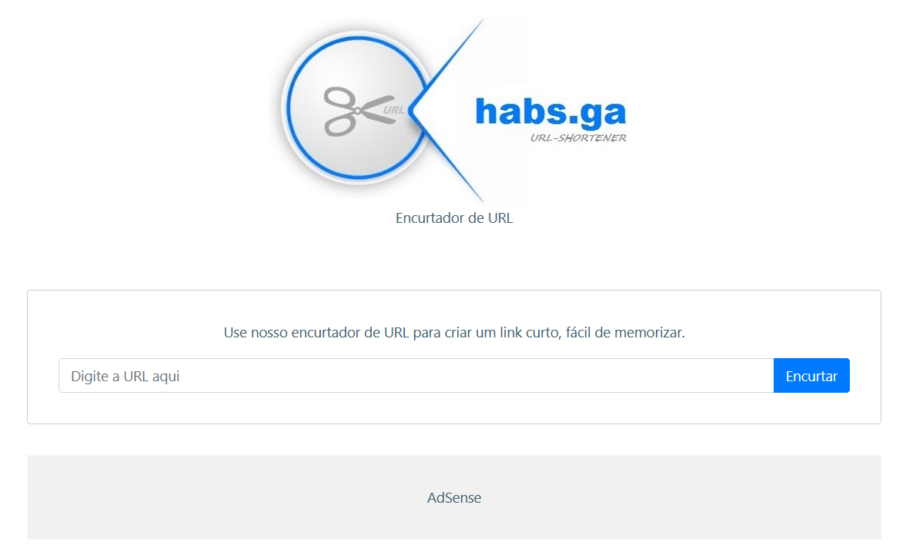

# URL shortener

Um micro-Saas simples para encurtar URL feito durante a Semana Web Full Stack JS, com [Luiz Tools](https://www.youtube.com/c/luiztools) e [Daniel Castro](https://www.instagram.com/danielcsrs/).

Projeto feito com front-end em ReactJS, back-end em Node.js + TypeScript e banco de dados MySQL.

## Tela inicial da aplicação

<kbd>
  
</kbd>

## :link: Aplicação em produção

A aplicação foi publicada na [AWS](https://aws.amazon.com/pt/) e a mesma pode ser acessada [aqui](http://www.habs.ga/).

Aproveite para encurtar suas URLs :+1:
