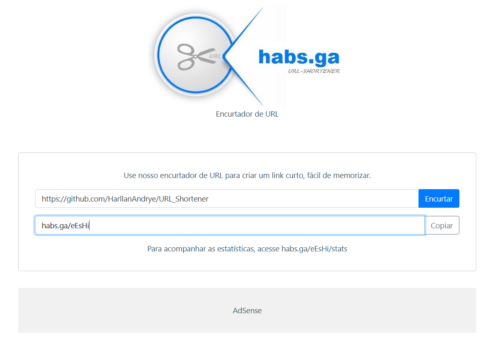

# Front-end

Tecnologias utilizadas:
- [ReactJS](https://reactjs.org/)
- [Bootstrap](https://react-bootstrap.github.io/)

Para baixar as dependências utilize o comando:
```
npm install
```

Para rodar a aplicação em modo de desenvolvimento:
```
npm start
```
A aplicação irá rodar em: `http://localhost:3000`.

A página irá recarregar sempre que existir alguma alteração no código.

Para "construir" a aplicação para produção, utilize o comando:
```
npm run build
```
Será criada uma pasta `build` com os arquivos minificados.

## Telas da aplicação

### Home
<kbd>
  
</kbd>

### Home com a URL gerada
<kbd>
  
</kbd>

### Estatísticas
<kbd>
  
</kbd>
